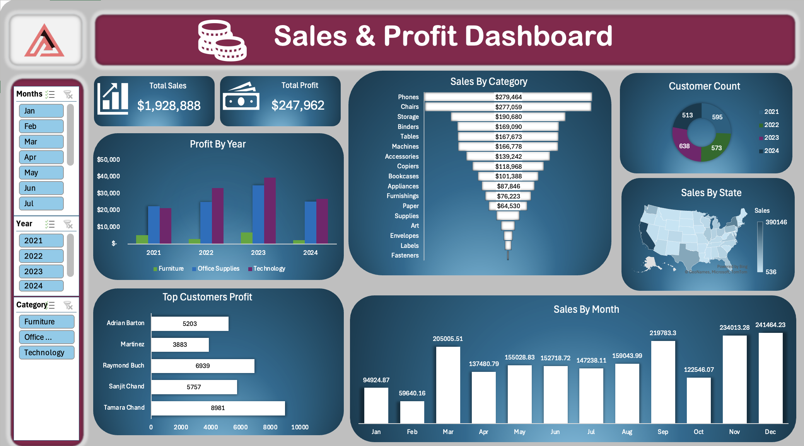

#  Sales & Profit Dashboard (Excel)

##  Overview

An interactive Excel dashboard developed to analyze sales performance, profitability trends, customer distribution, and regional sales insights.

The dashboard provides business intelligence using dynamic charts, slicers, and KPI indicators.

---

##  Business Objectives

- Monitor total sales and profit
- Analyze category-wise sales performance
- Track yearly profit trends
- Identify top-performing customers
- Visualize monthly sales patterns
- Analyze geographical sales distribution

---

##  Tools & Technologies

- Microsoft Excel
- Pivot Tables
- Pivot Charts
- Data Visualization
- Dashboard Design

---

##  Key Metrics

- Total Sales: $1,928,888
- Total Profit: $247,962

---

##  Dashboard Preview

---

##  Key Insights

- Technology category generated the highest profits
- Peak sales occurred during November and December
- Certain states significantly outperformed others in sales contribution
- Top customers contributed strongly toward profitability

---

##  Skills Demonstrated

- Excel Dashboard Development
- Data Visualization
- KPI Reporting
- Business Analytics
- Interactive Filtering
- Sales Analysis

---

##  Files Included

| File | Description |
|------|-------------|
| Sales and profit Project.xlsx | Main Excel dashboard |
| Sales and Profit Dashboard.png | Dashboard preview |
| README.md | Project documentation |

---

## 👨‍💻 Author

Pankaj Lamba
