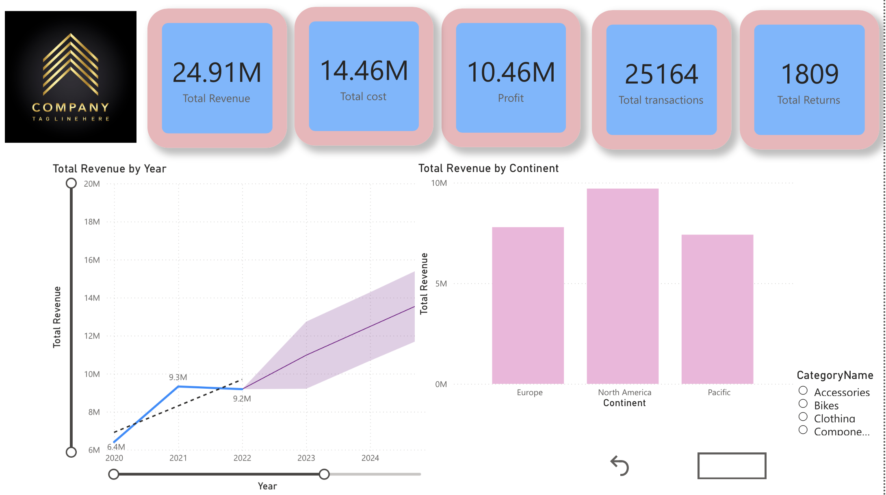

# 🚴 Adventure Works Sales Dashboard

##  Overview

This Power BI dashboard analyzes sales, revenue, profitability, and transaction performance for Adventure Works.

The dashboard provides interactive business insights across:
- Revenue trends
- Profit analysis
- Regional performance
- Product category insights
- Return analysis

---

##  Business Objectives

- Analyze yearly revenue growth
- Track profitability trends
- Compare continent-wise performance
- Monitor transaction and return metrics
- Support business decision-making through KPI dashboards

---

##  Tools & Technologies

- Power BI
- DAX
- Power Query
- Data Visualization
- Business Intelligence

---

##  Key Metrics

- Total Revenue: 24.91M
- Total Cost: 14.46M
- Total Profit: 10.46M
- Total Transactions: 25,164
- Total Returns: 1,809

---

##  Dashboard Preview

---

##  Key Insights

- North America generated the highest revenue contribution
- Revenue showed steady year-over-year growth
- Profitability remained strong despite increasing operational costs
- Product category analysis helped identify top-performing segments

---

##  Skills Demonstrated

- KPI Dashboard Development
- Interactive Reporting
- Business Analytics
- Trend Analysis
- Data Storytelling
- Dashboard Design

---

##  Files Included

| File | Description |
|------|-------------|
| Adventure-Works-Dashboard.pbix | Main Power BI dashboard |
| AdventureWorksDashboard.png | Dashboard preview |
| README.md | Project documentation |

---

##  Author

Pankaj Lamba
