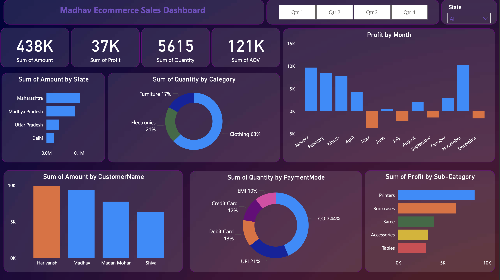

# 🛒 Madhav Ecommerce Sales Dashboard

##  Overview

A Power BI ecommerce analytics dashboard designed to monitor sales performance, customer behavior, product categories, and profitability trends.

The dashboard provides actionable business insights using interactive visualizations and KPI reporting.

---

##  Business Objectives

- Analyze ecommerce sales performance
- Monitor monthly profit trends
- Identify high-performing states and categories
- Evaluate payment method distribution
- Understand customer purchasing behavior

---

##  Tools & Technologies

- Power BI
- DAX
- Data Visualization
- Business Intelligence

---

##  Key Metrics

- Total Sales Amount: 438K
- Total Profit: 37K
- Total Quantity Sold: 5615
- Average Order Value: 121K

---

##  Dashboard Preview

---

##  Key Insights

- Maharashtra contributed the highest sales amount
- Clothing category dominated product sales
- COD was the most preferred payment mode
- Monthly profit trends highlighted seasonal fluctuations
- Printers generated the highest sub-category profit

---

##  Skills Demonstrated

- Sales Analytics
- Dashboard Development
- KPI Visualization
- Ecommerce Analytics
- Interactive Reporting
- Business Intelligence

---

##  Files Included

| File | Description |
|------|-------------|
| Sales-and-Profit-Dashboard.pbix | Main Power BI dashboard |
| RetailDashboard.png | Dashboard preview |
| README.md | Documentation |

---

##  Author

Pankaj Lamba
