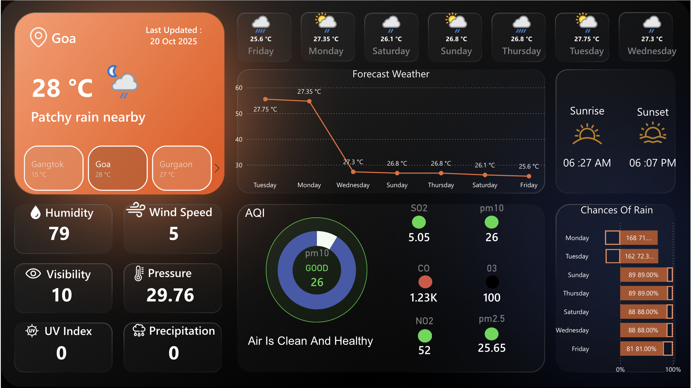
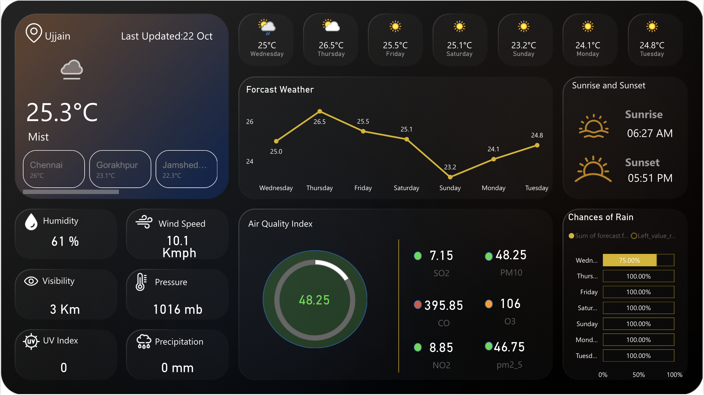

# ☀ Modern Weather Analytics Dashboard

##  Overview

A modern Power BI dashboard built for weather forecasting and environmental monitoring.

The dashboard provides detailed weather analytics including:
- Forecast trends
- AQI analysis
- Rain probability
- Temperature tracking
- Environmental indicators

---

##  Objectives

- Build an interactive weather monitoring dashboard
- Analyze atmospheric conditions
- Visualize multi-day forecasts
- Track environmental quality indicators
- Improve weather data accessibility through dashboards

---

##  Tools Used

- Power BI
- DAX
- Data Visualization
- Dashboard UI Design

---

##  Dashboard Preview

---

##  Features

- Dynamic weather forecasting
- AQI health monitoring
- Rain probability analysis
- Sunrise and sunset tracking
- Interactive KPI cards
- City-wise weather comparisons

---

##  Skills Demonstrated

- Dashboard Development
- Visual Analytics
- UI/UX Design
- KPI Visualization
- Interactive Reporting

---

##  Files Included

| File | Description |
|------|-------------|
| Weather-Dashboard.pbix | Main dashboard |
| MyWeatherDashboard.png | Dashboard preview |
| README.md | Documentation |

---

##  Author

Pankaj Lamba
